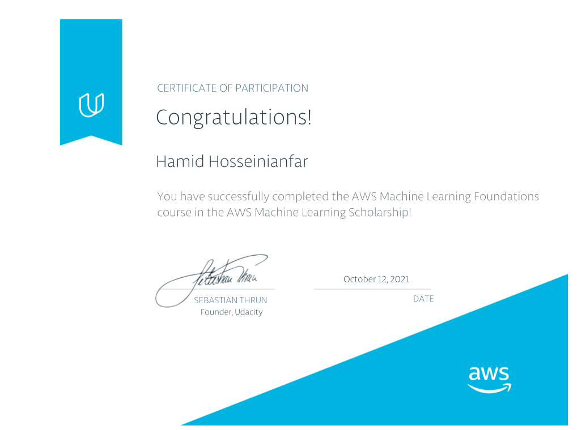
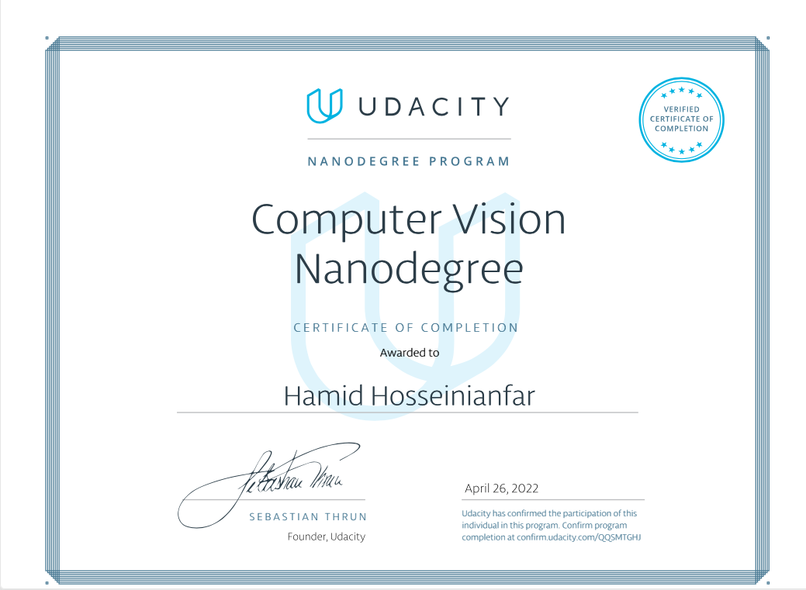
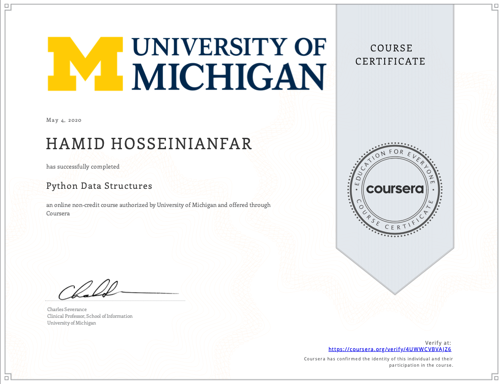
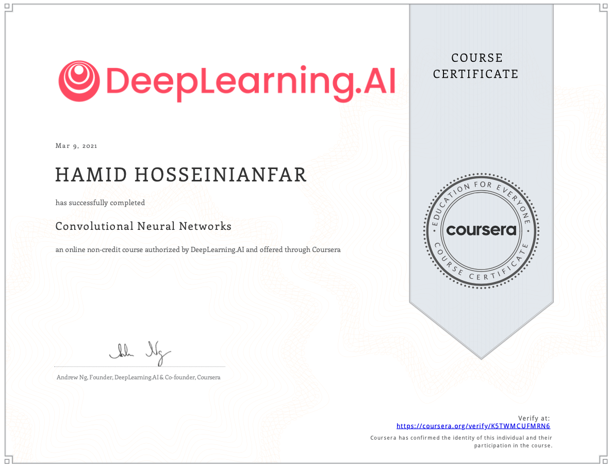
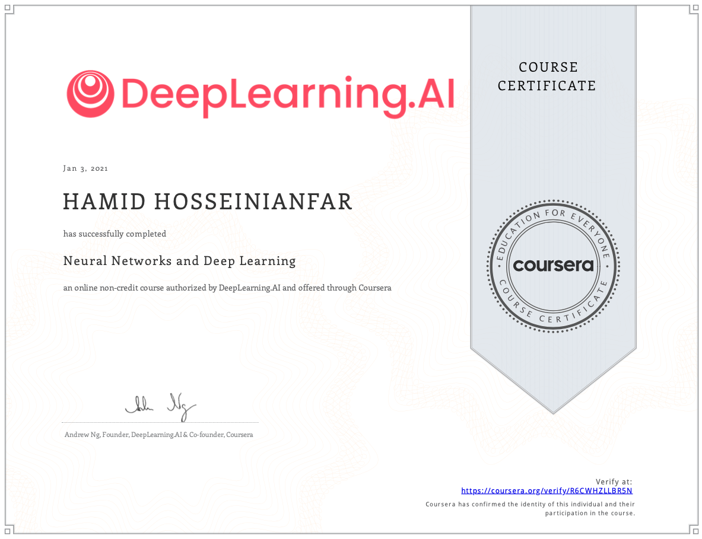
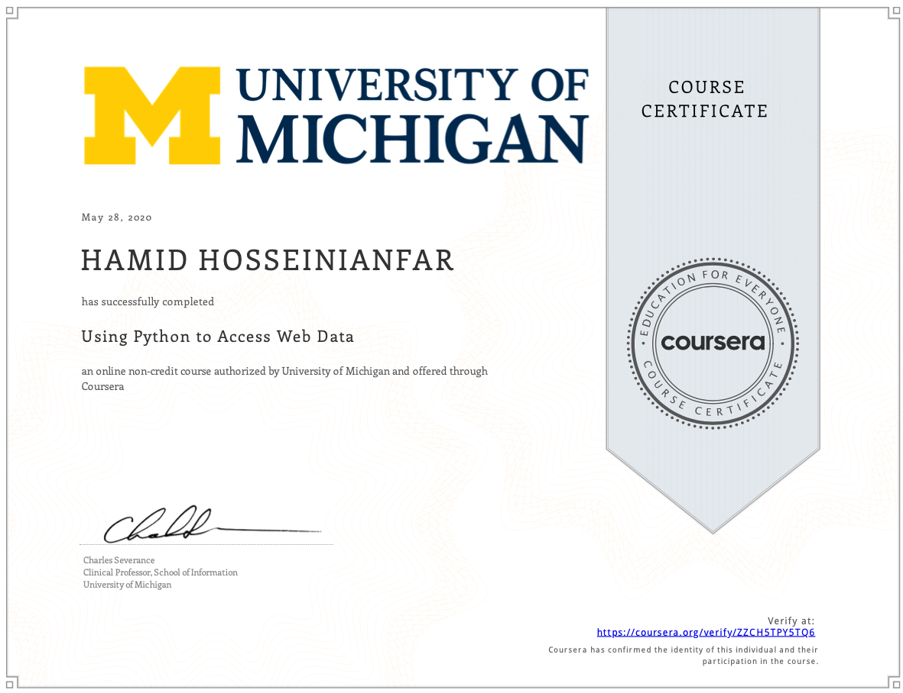

My research interests include Communication Theory, Machine Learning, Deep Learning, and Computer Vision. I will describe my repos briefly (to be public soon) in different areas of my research and demo of AI and computer projects I have accomplished. Please feel free to reach out to me at hhosseinianfar@gmail.com for any questions or collaboration. 

## Detailed Summary

As a detail-oriented researcher with a strong technical background in statistical modeling and communication theory, I bring a unique set of skills to the table. With experience in embedded system prototyping and electronic circuit design, as well as expertise in developing optical wireless localization techniques, I have a demonstrated ability to tackle complex challenges and deliver results.

I am passionate about communication systems, wireless technologies, machine learning, and statistical modeling. I have published numerous peer-reviewed papers on topics such as optical wireless communications, localization, and fiber optics. 

My technical skills include up to three years of FPGA prototyping on different telecommunication system projects, up to Five years of Python programming for research projects, and experience with scientific programming languages such as MATLAB, Simulink, Python, R, Git, and Numpy. I am proficient in deep learning and machine learning toolkits such as Tensorflow, Scikit-learn, Keras, and SciPy, and have expertise in deep learning models such as Convolutional Neural Networks (CNN, R-CNN, YOLO) and sequence models (RNN, BRNN).

In addition to my technical expertise, I have cultivated my entrepreneurial skills, which include developing business model canvases, conducting customer discovery, and validating market sizes. I have extensive experience in technology commercialization and statistical analysis. Furthermore, I possess exceptional verbal and written communication skills, which enable me to convey complex ideas and concepts to individuals of varying backgrounds. I am adept at collaborating with teams, utilizing each team member's unique skill set to achieve common goals.

I am currently seeking a research scientist or R&D engineer position that will allow me to continue to leverage my skills and expertise in machine learning, communication systems, and statistical modeling. If you are looking for a talented and innovative team player, I would love to hear from you.

## My Selected Certifications

### Image Thumbnails

|  |  |  |
|:--:|:--:|:--:|
|  |  |  |

<!---
hhosseinian/hhosseinian is a ✨ special ✨ repository because its `README.md` (this file) appears on your GitHub profile.
You can click the Preview link to take a look at your changes.
--->
